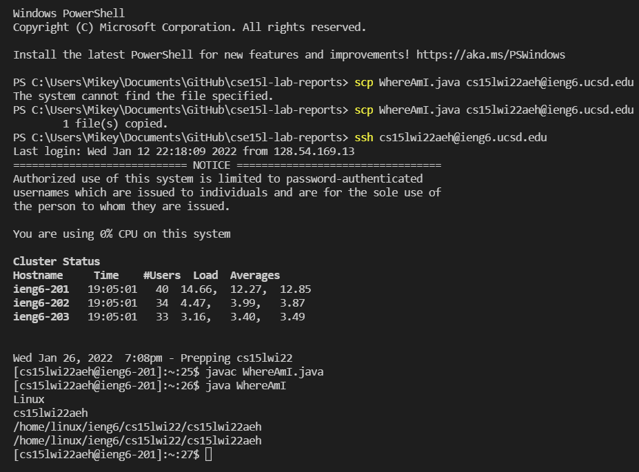

# LAB REPORT :

In this post, I am going to write about what I have learnt regarding remote access and show some examples of how the  connection between the client and the remote server is established. 
How one can run commands  on the remote server,  how files can be moved and certain operations can be carried out. 
Firstly, we need to install Visual Studio Code(VScode) on the client and use it’s  remote option to connect to the remote server.

# 1. Installing VScode :

Please visit [the following site](https://code.visualstudio.com/) and download and install the correct version based on the client operating system as per the instruction given.
After successful installations , one would be able to write java codes, compile and run  the program if java is installed.
Given below is a screenshot of one of my java program written using VScode.  Please remember that terminal opens in the current working directory:

# 2. Remotely Connecting :

Firstly one needs to install a program called OpenSSH if  it is running on Windows  operating systems.
Next is to  obtain a course-specific account for CSE15L from 
[the following site](https://sdacs.ucsd.edu/~icc/index.php)
(I, for example, logged into my cse15L account to retrieve my username and change my password)
Now open a VScode terminal and run the following `ssh` command appending the letters of the course-specific account and enter the password as shown in the following screenshot.

The above shows that I am logged into the remote server.

# 3. Trying some commands :

I shall now run some standard commands such `ls` , `ls –lat` etc  to show you the following outputs.
We can also copy files by running standard cp commands.

# 4. Moving files with `scp` :

One of the basic requirements would be that of copying files back and forth between computers and that can be achieved using `scp` command .
The following example shows that I first run a java program in my client after compiling it locally  
Then using `scp` command I move the java file to the remote server. 
I log in using `ssh` , compile and run the program on the server as shown in the following  sequence of screenshots.

# 5. Setting an SSHkey :

In order that we don’t need to type our password every time we log in with `ssh` or move files with `scp` , we can create `ssh` keys to make things easier. 
We call a program called `ssh-keygen` which creates a pair of files called the public key and private key. 
You copy the public key to a particular location on the server, and the private key in a particular location on the client as shown in the following screenshot.

The above created two new files on our system; the private key (in a file id_rsa) and the public key (in a file id_rsa.pub), stored in the `.ssh` directory on our computer.
Next step would be to  copy the public (not the private) key to the `.ssh` directory of the user account on the server by making a directory `.ssh` on the server.
The `scp` command may be used for this purpose.

Then I instantiated the process of logging in without the password as follows:

# 6. Optimizing Remote Running :

One can write a command in quotes at the end of an `ssh` command to directly run it on the remote server and then exit. 
For example, this command will log in and list the home directory on the remote server:

Another thing which one could possibly do is to use semicolons to run multiple commands on the same line in most terminals. For example, I tried:

In order to make remote running an even more pleasant experience, one can make a local edit (For example to the file WhereAmI,java) and then copy it to the remote server and run it.

The following is an optimization and I was successfully able to reduce from 26 to 6 keystrokes.

The way I optimized remote running was by using the up arrow multiple times, rather than writing the characters. 

