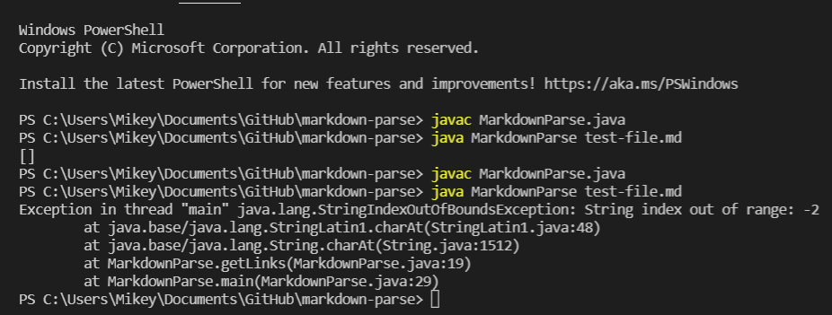

# LAB REPORT 2 :

In this post, I am going to create another page in my lab report repository, like I did for lab report 1, and write my report here.

I have picked three code changes that my group worked on in labs 3 and 4 in order to fix a bug; which have been stored as commits on my repository. 

# CODE CHANGE 1:

The first error which we face is that of an infinite loop.

In the image below one can see the changes made in the code, highlighted in the green portion.
With the following change, the required test passes, producing no errors. 

Please click the following link [Following Link](https://github.com/IshanBanerjee2003/cse15l-lab-reports/blob/main/test-file2.md)  to access the test file which causes the problem.

The error created has been shown in the image below:

Description:
 
Without the edited code, it results in an infinite loop, and it ends up using all the memory, hence causing the OutOfMemory error.

# CODE CHANGE 2:

The second error which we face is that of a logical error.

In the image below one can see the changes made in the code, highlighted in the green portion.
With the following change, the required test produces our desired output.

Please click the following link [Following Link](https://github.com/IshanBanerjee2003/markdown-parse/blob/main/test-file9.md)  to access the test file which causes the problem.

The error created has been shown in the image below:

Description:

The format for writing a link and a image is very simiar, hence it might lead to some confusion, but the code should return just the link, which it does not in the first case, but after making the changing it does.

# CODE CHANGE 3:

The third error which we face is that of an indexOutOfBounds exception.

In the image below one can see the changes made in the code, highlighted in the green portion.
With the following change, the required test passes, producing no errors.

Please click the following link [Following Link](https://github.com/IshanBanerjee2003/markdown-parse/blob/main/test-file.md)  to access the test file which causes the problem.

The error created has been shown in the image below:

Description:

The text file just has a single space and hence the index of the nextOpenBracket becomes -1, which results in an indexOutOfBounds exception. However after editing the code, in which we prompt it to break out of the loop, when such a scenario arrives, our problem is solved.

- Ishan Banerjee

