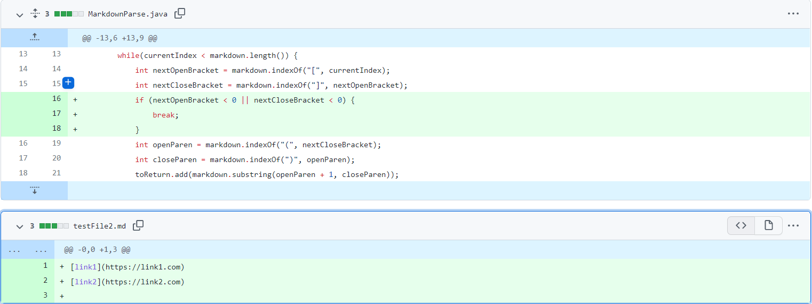
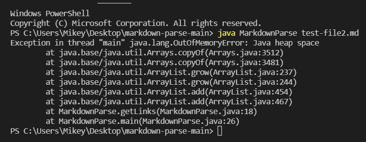
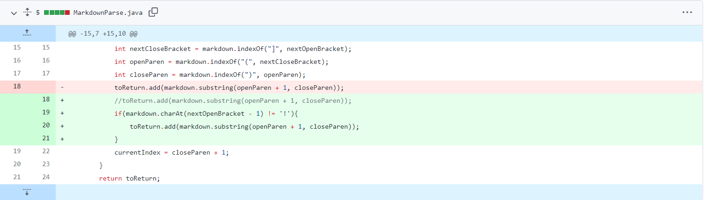
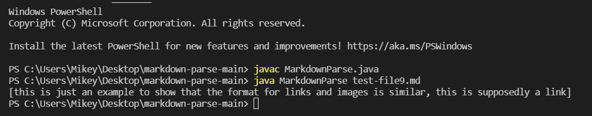
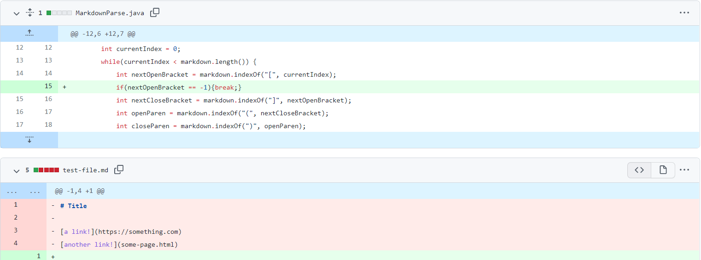

# LAB REPORT 2 :

In this post, I am going to create another page in my lab report repository, like I did for lab report 1, and write my report here.

I have picked three code changes that my group worked on in labs 3 and 4 in order to fix a bug; which have been stored as commits on my repository. 

# CODE CHANGE 1:

The first error which we face is that of an infinite loop.

In the image below one can see the changes made in the code, highlighted in the green portion.
With the following change, the required test passes, producing no errors. 

Please click the following link [Following Link](https://github.com/IshanBanerjee2003/cse15l-lab-reports/blob/main/test-file2.md)  to access the test file which causes the problem.

The error created has been shown in the image below:

Description:
 

# 2nd CODE CHANGE:

Please click the following link [Following Link](https://github.com/IshanBanerjee2003/cse15l-lab-reports/blob/main/test-file9.md)  to access the test file which causes the problem.

Error:

Description:

Logical error

# 3rd CODE CHANGE:

Please click the following link [Following Link](https://github.com/IshanBanerjee2003/markdown-parse/blob/main/test-file.md)  to access the test file which causes the problem.

Error:

Description:

