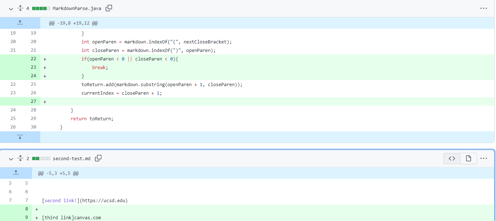

# LAB REPORT 2 :

In this post, I am going to create another page in my lab report repository, like I did for lab report 1, and write my report here.

I have picked three code changes that my group worked on in labs 3 and 4 in order to fix a bug; which have been stored as commits on someone’s repository. 

# 1st CODE CHANGE:

Please click the following link [Following Link](https://github.com/IshanBanerjee2003/cse15l-lab-reports/blob/main/test-file2.md)  to access the test file which causes the problem.

Error:

Description:
 
infinite loop.....

# 2nd CODE CHANGE:

Please click the following link [Following Link](https://github.com/IshanBanerjee2003/cse15l-lab-reports/blob/main/test-file9.md)  to access the test file which causes the problem.

Error:

