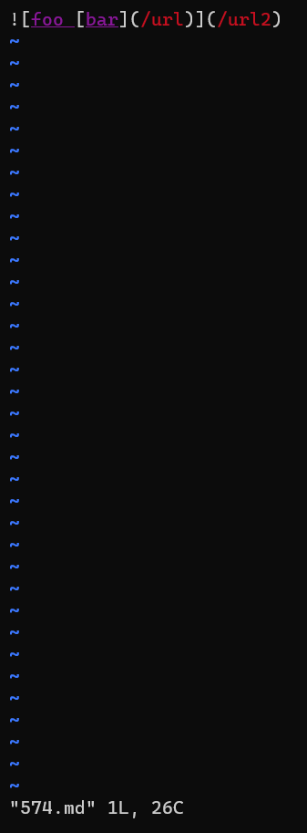
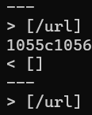
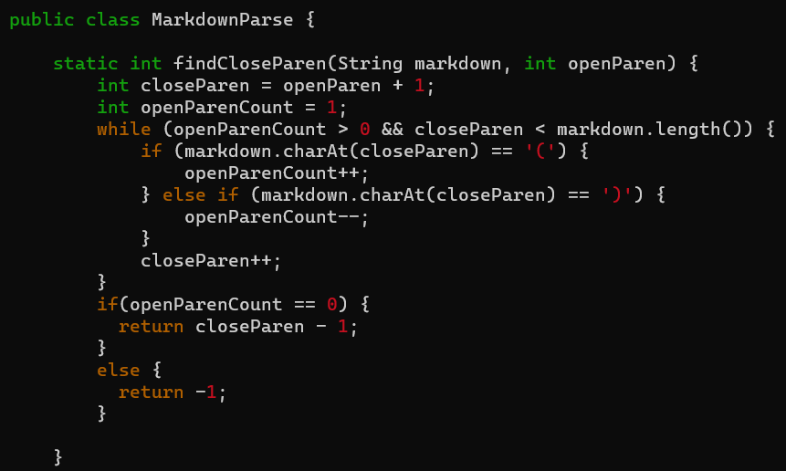
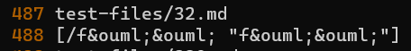
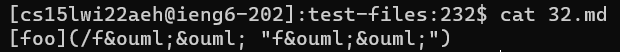
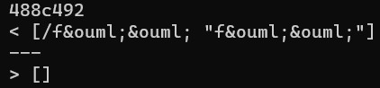

# LAB REPORT 5 :

In this post, I am going to create another page in my lab report repository, like I did for lab report 1, 2, 3 and 4 respectively, and write my report here.

# Difference 1:

The first difference occurs when we access file 574 of the test files.

The screenshot below represents what the file contains:

The screenshot below shows how Joe's and my program responded to the following file:

# Problem:

As one can notice, according to Joe's program, the output is '[/url]', where as according to my program, the output is blank.

According to vscode, the output should be a blank.

My code for this particular file is correct.

The possible mistake in Joe's program is that, that particular code does not account for the nested links. It thinks the nested link is a link.

# Solution:

A possible solution to the above mistake can be done by keeping track of the open and close parens/brackets. Making sure a nested link doesn't get counted. 

Above is a screenshot of Joe's code and one can observe that it does not take into account the case for a nested link.

# Difference 2: 

The second difference occurs when we access file 487 of the test files, as shown below:

The screenshot below represents what the file contains:

The screenshot below shows how Joe's and my program responded to the following file:

According to vscode, foo is a link.

My code for this particular part is correct.

# Problem:
The possible error in Joe's program is that it doesn't account for long substrings with blank and non-blank characters in between the open and close parentheses.  

# Solution:
A possible solution to the above mistake can be done by keeping track of the long substrings with blank and non-blank characters. That way the error would not occur.

Thank you for reading:

- Ishan Banerjee

