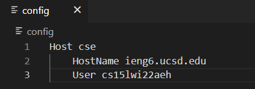
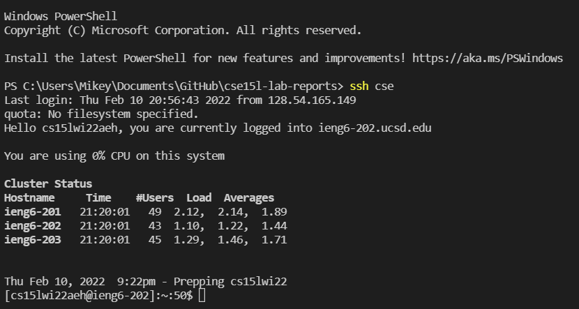
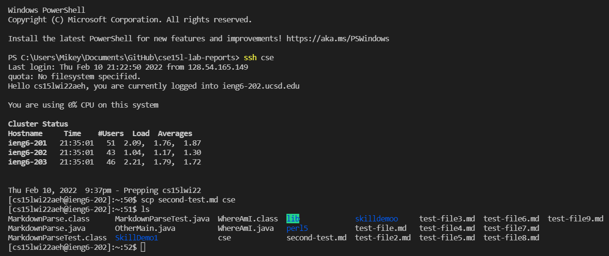

# LAB REPORT 3 :

In this post, I am going to create another page in my lab report repository, like I did for lab report 1 and 2, and write my report here.

The group question I'm working on is streamling the ssh configuration. I have relevant screenshots listed below supporting my statements.

I open my home directory, selected my respective drive and opened the `ssh` folder from the user section. 

In the `ssh` folder, I created a file named config. I edited the file using vscode, made an alias name which was - `cse` - 

I also entered my username which was cs15lwi22aeh, so that from the next time onwards, I do not have to write the entire thing like 
`ssh cs15lwi22aeh@ieng6.ucsd.edu`
and instead we can just write ssh and then the alias which is `cse` in this case.

Below is the image of what the `config` file contains and he respective changes made to it. It may be noted that all the editing has been done offline in VScode itself.

As one can see, I have made an alias under the name `cse`. 

Let us now see whether it is working properly or not.
For that instead of writing the entire thing like
> `ssh cs15lwi22aeh@ieng6.ucsd.edu`

we will just write ssh and then the alias which is cse in this case. 

Below is a screenshot provided where we try to do the above.

As one can see, I have successfully logged into the system using just the `ssh` command with just the alias name which is cse.

The next step is to see whether we can successfully copy a file or not after using the alias name.

Below is the screenshot where I successfully copy the file in the system.

 
 
As one can see we copied the **second-test.md** file and moreover to confirm that it is copied I use the `ls` command to verify that the file exists within the server. 

Let us now check the time difference between the two commands.

The new command which is 
> `ssh cse` 

is significantly faster (15 seconds faster) than the older command which is

> `ssh cs15lwi22aeh@ieng6.ucsd.edu`

Also the number of keystrokes is significantly lesser(23 characters lesser)
- _Ishan Banerjee_(A16927000)