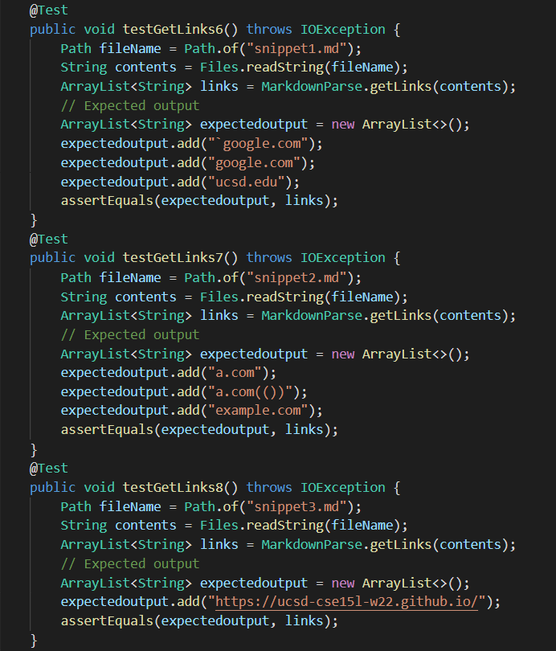
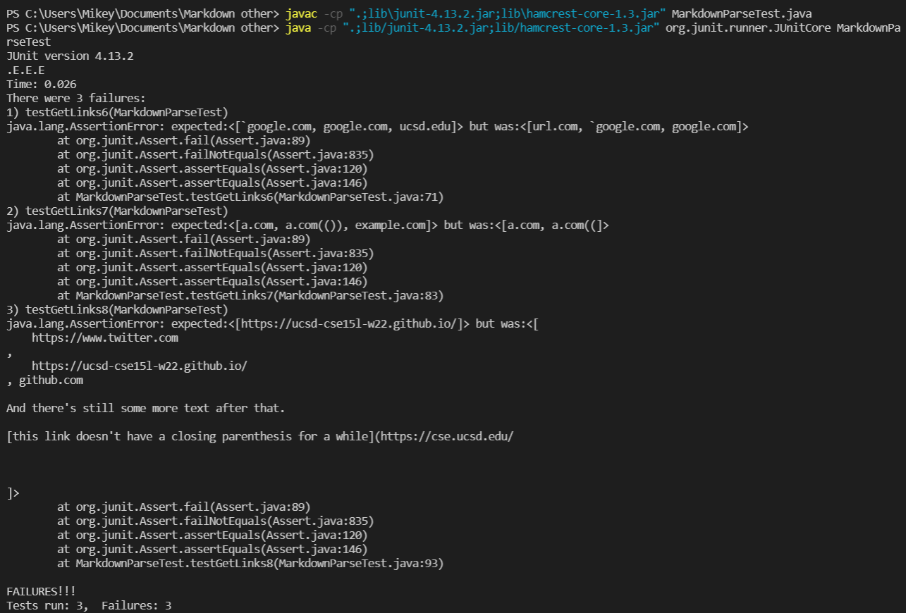
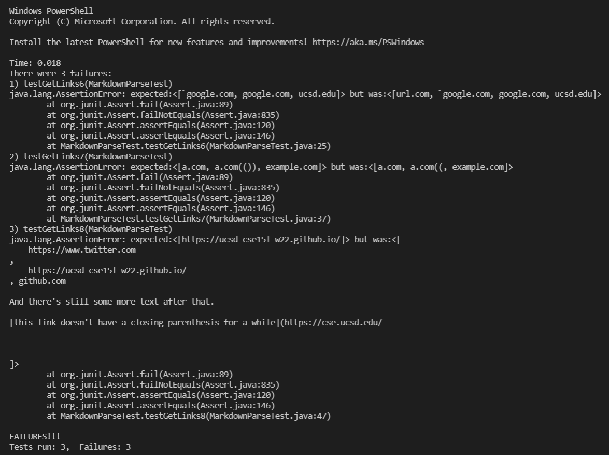

# LAB REPORT 4 :

In this post, I am going to create another page in my lab report repository, like I did for lab report 1, 2, and 3 respectively, and write my report here.

For each snippet, I have added a test both to my implementation of markdown-parse, and the implementation that we as a group reviewed.

The link to the markdown-parse repository which we reviewed can be accessed through [the following link](https://github.com/johnsonli010801/markdown-parse)

Both of us ran the same tests and the expected values can be seen as shown in the screenshot below.

Given below is the screenshot of how I ran the tests taken from the other person's repository. It fails all three tests.

Shown below is the screenshot of how I ran the tests on my MarkdownParse code. Unfortunately, it fails all the three tests here too.

# Probabale solutions for the Failed Tests :

# Snippet 1 :

In snippet 1, it is not expected that url.com will become a link
but according to my program, it is. 

The probable solution to the above problem might be to make sure that a pair of backticks dosen't lie near the square brackets.

Otherwise, we would have to keep track of the closest open and closed backticks.

# Snippet 2 :

In snippet 2 , the statements in the first and the fifth line work but somehow the statement in the third line fails.

We don't get what we are expected because of the prescence of too many paranthesis.

A probable solution to the above problem would be to account for the number of paranthesis in the statement.

# Snippet 3 :

In snippet 3, the links are displayed with spaces and new lines, which it is not expected to.

A probable solution to this problem would be to ignore all new line characters within parenthesis, and to ignore all blank spaces as well.

- Ishan Banerjee